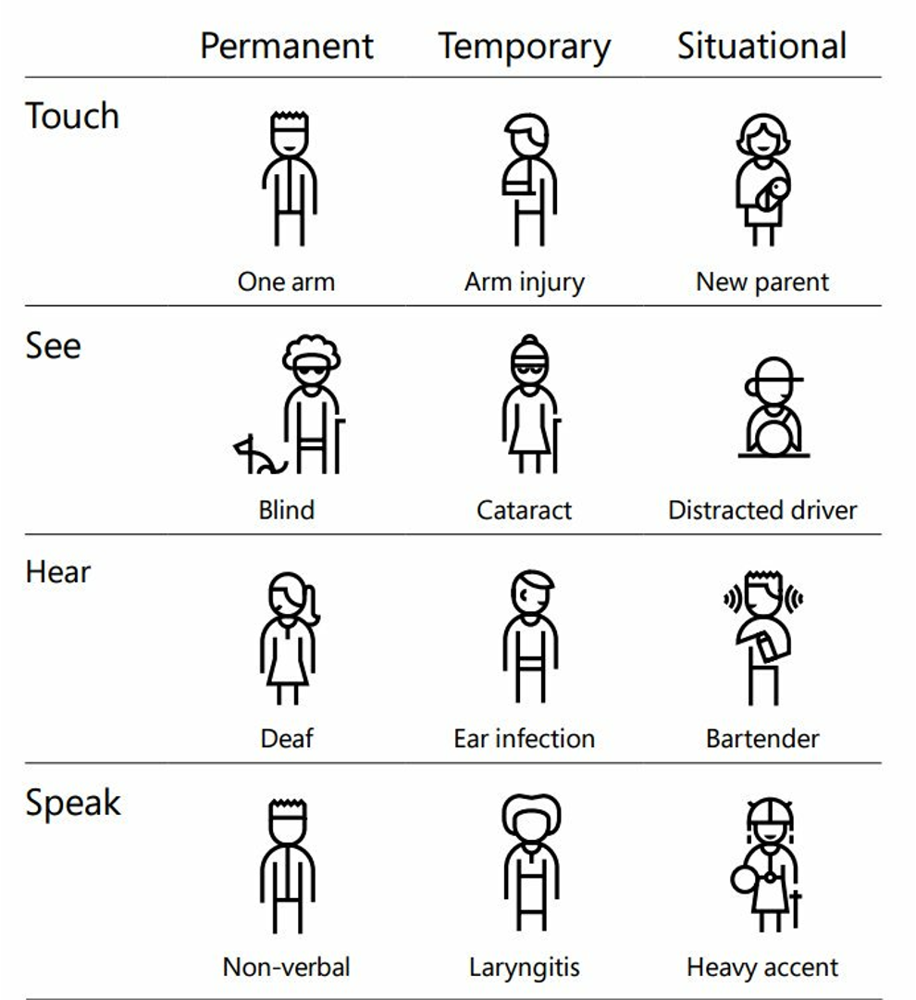
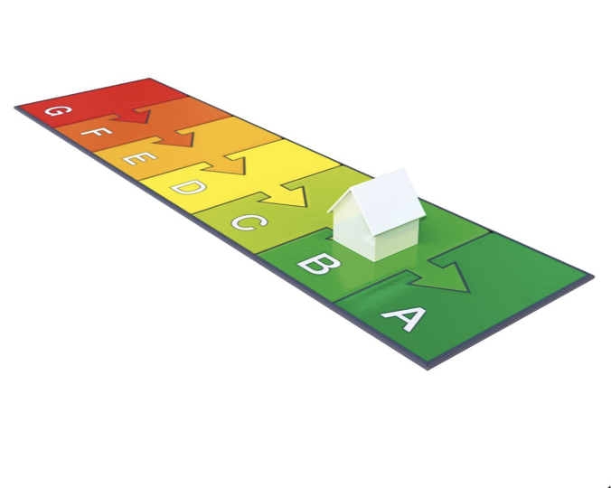
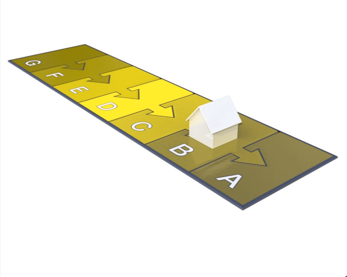
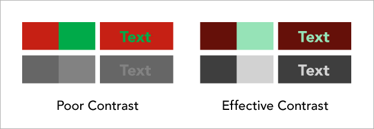
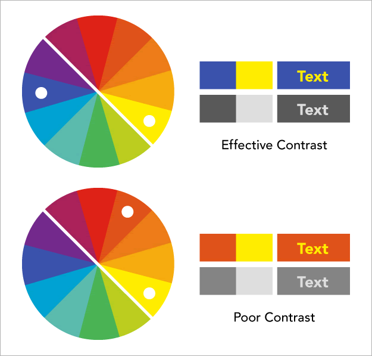
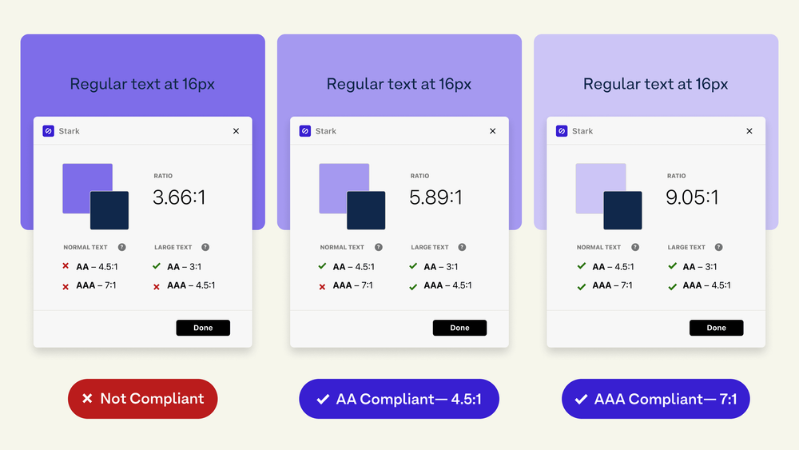

# All Human - Accessible Website

## Kleur en Contrast

In deze workshop leer je hoe je goede kleurcontrasten kan ontwerpen en testen voor een goede toegankelijkheid.

### Omgevingsfactoren en beperkingen

Je denkt misschien dat iedereen kleuren en contrasten op een zelfde manier ervaart zoals jij. Maar het ervaren van kleuren op een website wordt beïnvloed door omgevingsfactoren en hoe mensen kleuren waarnemen.

Verschillende apparaten laten kleuren op een andere manier zien, een Kindle heeft bijvoorbeeld een zwart-wit scherm. Ook de *display settings* van een scherm zijn van invloed op de kleuren, een scherm kan donker maar ook heel *bright* ingesteld staan, en veranderen gedurende de dag. Ook omgevingslicht zoals zonlicht is bepalend, probeer maar eens teksten te lezen op je mobiel als de zon in je scherm schijnt.

Naast de omgevingsfactoren kan het natuurlijk ook voorkomen dat je gebruikers kleurenblind of slechtziend zijn.


*Gebruikers kunnen permanente, tijdelijke of situationele beperkingen ondervinden - [microsoft.com/design/inclusive](https://www.microsoft.com/design/inclusive/)*

Door rekening te houden met kleuren en contrast kun je ervoor zorgen dat alle mensen de informatie op je website goed kunnen lezen en zien. In deze workshop ga je 4 opdrachten uitvoeren om te leren hoe je goede kleurcontrasten kan ontwerpen en testen:

## Gebruik naast kleuren altijd alternatieve informatie

Een aanzienlijk deel van je bezoekers is kleurenblind en ziet kleuren misschien anders dan je hebt ontworpen. Ongeveer 10% van de mannen en bijna 2% van de vrouwen zijn kleurenblind. Zorg er daarom voor dat je naast kleuren altijd extra informatie toont om je boodschap over te brengen.


*De kleuren van de energielabels lopen van rood naar groen. Rood is slecht. Groen is goed.*


*Voor mensen die kleurenblind zijn, zijn de kleuren verwarrend, dezelfde kleuren worden gebruikt voor verschillende energielabels.*

### Opdracht 

Gebruik in Chrome de Devtools om de kleuren van jouw project te testen voor kleurenblindheid. Schrijf een issue als je een probleem tegenkomt.

``` Open Chrome Devtools > Click 3 dots > Select Rendering > Emulate vision deficiencies```

### Bronnen

- [Designing for Color Blindness With Chrome DevTools (in Just 4 Clicks)](https://webdesign.tutsplus.com/designing-for-color-blindness-with-chrome-devtools--cms-35827a)


## Gebruik onderscheidende kleuren

Voor goed leesbare teksten, maar ook voor bijvoorbeeld de visuele hiërarchie is het onderscheid in kleuren belangrijk. Een hoog kleurcontrast valt meer op en weinig contrast zorgt ervoor dat teksten moeilijk te lezen zijn. 

Hoe ontwerp je goede kleurcontrasten?

### Licht-donker kleurcontrast



De rode en groene kleur aan de linkerkant hebben vergelijkbare helderheid (*lightness*), dit zorgt voor niet genoeg contrast. Door de helderheid van de achtergrondkleur te verminderen kan het contrast worden verbeterd. Als je de kleuren uit het plaatje in grijstinten weergeeft, blijkt dat de versie aan de rechterkant veel effectiever is.

### Complementair kleurcontrast


Effectieve kleurcontrasten zijn complementaire kleuren. Dat zijn de kleuren die tegenover elkaar staan op de kleurencirkel. Het is belangrijk om te onthouden dat het complementair contrast met rode en groene kleuren problemen opleveren voor de meeste kleurenblinden.

### Warm-koud kleurcontrast



Stel je een kleurencirkel voor die is verdeeld in koude kleuren zoals blauw, paars en groen, en vergelijk deze met warme kleuren zoals rood, oranje en geel. De gele tekst op de blauwe achtergrond geeft een beter contrast dan gele tekst op een oranje achtergrond. Teksten met een lichte tint van een warme kleur op een achtergond van een donkere tint van een koude kleur zorgt voor een beter contrast dan twee warme kleuren of twee koude kleuren.

### Opdracht 

Bekijk het kleurgebruik in je Figma ontwerp. Vergelijk de gebruikte teksten en kleuren met de kleurencirkel en noteer in het Figma document of het een licht-donker kleurcontrast, complementair kleurcontrast en/of warm-koud kleurcontrast is. 

Schrijf een issue als je een probleem tegenkomt. Dit kan je later bespreken met de studenten die dezelfde opdracht hebben. Als je een beter kleurcontrast voor het probleem hebt, kan je dit bespreken tijdens de Sprint Review met de opdrachtgever.

### Bronnen

- [Integrating Contrast Checks in Your Web Workflow](https://24ways.org/2014/integrating-contrast-checks-in-your-web-workflow/)


## Teksten op plaatjes

Teksten op een plaatje worden vaak gebruikt in webdesign. Maar je kan je misschien wel voorstellen dat het niet altijd goed te lezen is, omdat de kleurcontrasten onvoldoende zijn.


*Door het gebruiken van een overlay of semi-transparent gradient is een tekst beter leesbaar.*

### Opdracht

In het artikel “Designing Accessible Text Over Images: Best Practices, Techniques, And Resources” worden verschillende problemen en oplossingen beschreven voor teksten op plaatjes. Bekijk de 5 oplossingen die in het artikel worden besproken. Bedenk hoe je het effect met CSS kan bereiken en teken een breakdown schets op het whiteboard met jouw CSS oplossing.

### Bronnen

- [Designing Accessible Text Over Images: Best Practices, Techniques, And Resources](https://www.smashingmagazine.com/2023/08/designing-accessible-text-over-images-part1/)
- [Add A Gradient Overlay Using Border-Image @ css-tip.com](https://css-tip.com/gradient-overlay-border-image/)


## Kleurcontrasten testen

De Web Accessibility Guidelines (WCAG) zijn richtlijnen van het W3C voor toegankelijkheid. In de  richtlijnen staat beschreven hoe webcontent toegankelijk kan worden gemaakt voor een zo breed mogelijk publiek.

In de richtlijnen zijn 4 principes beschreven:

1. Waarneembaar (perceivable): alle informatie en alle componenten van de gebruikersinterface moeten waarneembaar zijn door de gebruiker.
2. Bedienbaar (operable): alle componenten van de gebruikersinterface en de navigatie moeten bedienbaar zijn door de gebruiker.
3. Begrijpelijk (understandable): alle informatie en het gebruik van de interface moet begrijpelijk zijn voor de gebruiker.
4. Robuust (robust): content moet betrouwbaar geïnterpreteerd kunnen worden door uiteenlopende soorten *user agents* en **assistive technologies*.

<!-- Kleur en contrast hoort bij de richtlijn 1.4 Onderscheidbaar (Distinguishable) van het onderdeel Waarneembaar (perceivable).  Kleurcontrast kan je meten en beoordelen met de WCAG standaarden. -->

In de richtlijnen staat waar je kleurcontrasten aan moeten voldoen voor een goede toegankelijkheid. Hoe hoog of laag een kleurcontrast is, kan je zien aan de contrast ratio’s. Daarvoor wordt de voorgrondkleur vergeleken met de achtergrondkleur.


*Een hoog contrast voor normale teksten heeft bijvoorbeeld een contrast ratio van 9:1. Een te laag contrast is bijvoorbeeld 3:1.*

Voor contrasten worden 3 *levels* onderscheiden:

- A level: het minimale niveau waar het contrast aan moet voldoen
- AA level: een contrast niveau dat voor de meeste gebruikers toegenkelijk is
- AAA level: het hoogste niveau, het is toegankelijk voor alle gebruikers

Kleurcontrast kan je testen en beoordelen met behulp van de WCAG richtlijnen.

### Opdracht

- Installeer de *Colour Contrast Analyser* van TPGI. Je kan de app hier downloaden: https://www.tpgi.com/color-contrast-checker/.
- Doorloop stap voor stap de checklist van het A11Y Project over Color Contrast en test je eigen website: https://www.a11yproject.com/checklist/#color-contrast
- Maak per stap een issue aan met de titel van de check, beschrijf wat je hebt getest en noteer de testresultaten, voeg een screenshot toe, en als je een probleem hebt gevonden noteer dan wat er verbeterd kan worden.

### Bronnen

- [WCAG Quick Reference](https://www.w3.org/WAI/WCAG22/quickref/?versions=2.1)
- [The a11project - Color Contrast](https://www.a11yproject.com/checklist/#color-contrast)
- [Accessible contrast ratios and A-levels explained](https://www.getstark.co/blog/accessible-contrast-ratios-and-a-levels-explained/)
- [contrast-ratio.org](https://contrast-ratio.org/)

<!-- 
Related WCAG success criteria
1.4.3 Minimum contrast (AA)
The color contrast between background and foreground content should be at a minimum level to ensure legibility:

Text and its background should have a contrast ratio of at least 4.5:1.
Heading (or just larger) text should have a ratio of at least 3:1. Larger text is defined as at least 18pt, or 14pt bold.

1.4.6 Enhanced contrast (AAA)
This follows, and builds on, criterion 1.4.3.

Text and its background should have a contrast ratio of at least 7:1.
Heading (or just larger) text should have a ratio of at least 4.5:1.

1.4.11 Non-Text Contrast (AA) (added in 2.1)
There should be a minimum color contrast ratio of 3 to 1 for user interface components and graphical objects.
-->
