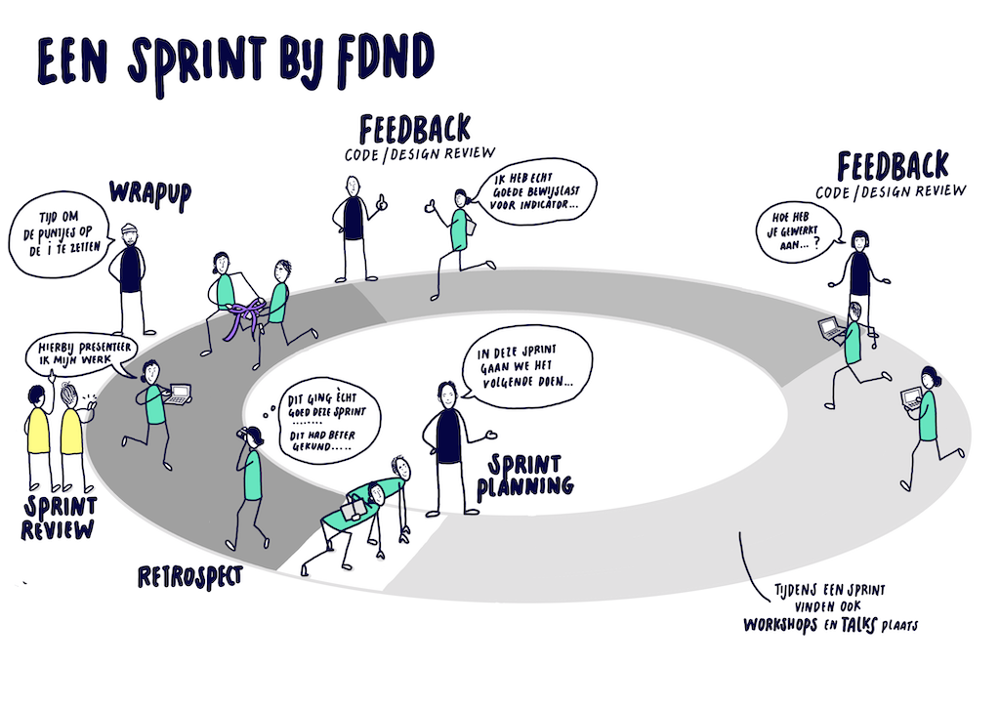

# All Human - Accessible Website

## Wrap up

Tijdens de Wrap up ga je bekijken wat je nog kan afmaken voor de Sprint Review; wat wil je donderdag laten zien en wat is daar nog voor nodig? Ook zorg je ervoor dat je project een nette professionele Readme krijgt.

### Sprint Review 

Elke sprint ga je je werk demonstreren en overleggen met de opdrachtgever tijdens de Sprint Review.

De Sprint Review is geen Powerpoint presentatie. Het is de bedoeling om feedback te krijgen op het werk. Bedenk wat je donderdag wil laten zien en wat is daar nog voor nodig? Betrek de opdrachtgever bij het werk dat je aan het doen bent.

Bereid de Sprint Review voor met alle studenten die dezelfde opdracht hebben. Schrijf op het whiteboard samen wat tegenviel vorige keer, of wat je gemist hebt. Bedenk ook hoe je het deze keer beter kunt gaan doen. Misschien wel door je beter voor te bereiden op de Sprint Review. In Sprint 2 heb je geleerd hoe je dat goed kunt doen. Doorloop dezelfde stappen voor een goede voorbereiding: https://github.com/fdnd-task/the-client-website/blob/main/docs/sprint-review.md

### Readme

Als mensen jouw werk bekijken, wordt eerst de Readme gelezen om te begrijpen wat je gedaan hebt. Het is belangrijk om dit bestand heel duidelijk te schrijven.

In Sprint 2 heb je geleerd hoe je een nette Readme kan maken. Dit kan je weer toepassen in deze sprint. Bekijk je Readme van de vorige sprint, bedenk wat je deze keer beter kunt doen, en waar je de nadruk op wil leggen. Je hebt aan Toegankelijkheid gewerkt deze sprint, dus waarschijnlijk wil je daar iets over schrijven. Gebruik de uitleg en bronnen uit de vorige sprint als leidraad: https://github.com/fdnd-task/the-client-website/blob/main/docs/wrap-up.md

Laat ook andere studenten naar jouw readme kijken en geef feedback op elkaars voorbereiding.
